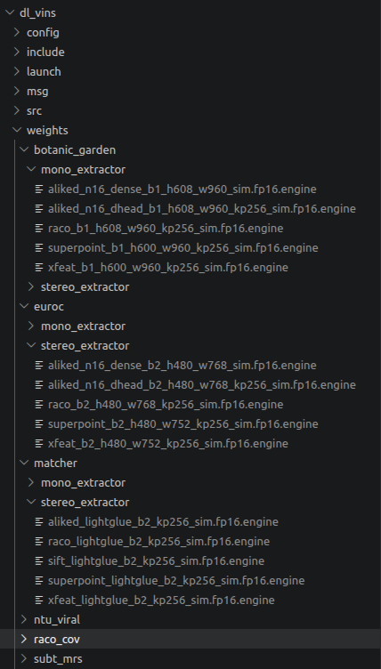

# DL-VINS TensorRT engine zoo

Serialized TensorRT engines for the deep front-end (feature extractors + LightGlue
matchers). `.engine` files are **gitignored and built per machine** — a TensorRT
engine is not portable across GPU architectures / TensorRT versions, so each machine
(x86-64 dev box, Jetson, …) rebuilds its own engines into this tree. Only one
platform's engines live in a checkout at a time;

## Layout

```
weights/
├── matcher/                      # shared across ALL datasets (resolution-independent)
│   ├── mono_extractor/           # single-pair engines  (batch 1)
│   └── stereo_extractor/         # batched engines      (batch 2)
└── <dataset>/                    # euroc, ntu_viral, botanic_garden, subt_mrs, …
    ├── mono_extractor/           # extractor engines, batch 1
    └── stereo_extractor/         # extractor engines, batch 2
```

- `<dataset>/<role>/` holds **extractor** engines only, sized to that dataset's image
  resolution. `<role>` is `mono_extractor` (batch 1) or `stereo_extractor` (batch 2).
- `matcher/<role>/` holds **matcher** engines. These are resolution-independent (the
  engine takes `(1, K, 2)` keypoints + `(1, K, D)` descriptors; image size only enters
  as a runtime normalization scalar), so one shared set serves every dataset. The
  mono variant is single-pair (batch 1); the stereo variant is batched (`_b2`, for the
  temporal-L / stereo-LR passes fused into one call).



## Filename convention

Engine metadata is encoded in the **filename**, not in extra folder levels:

```
<model>_b{N}_h{H}_w{W}_kp{K}_sim.fp16.engine        # extractor
<model>_lightglue[_b{N}]_kp{K}_sim.fp16.engine      # matcher
```

| Field        | Meaning                                  | Example          |
|--------------|------------------------------------------|------------------|
| `<model>`    | superpoint / aliked / raco / xfeat       | `superpoint`     |
| `_b{N}`      | batch: 1 mono extractor, 2 stereo extractor, 2 stereo matcher | `_b2` |
| `_h{H}_w{W}` | input resolution (must be model-divisible; ALIKED ÷32) | `_h480_w752` |
| `_kp{K}`     | max keypoint budget                      | `_kp256`         |
| `_sim`       | onnx-simplified                          |                  |
| `.fp16`      | precision                                |                  |

ALIKED is split into two extractor engines: a dense backbone
`aliked_n16_dense_b{N}_h{H}_w{W}_sim.fp16.engine` (no `_kp`, outputs dense maps) and a
descriptor head `aliked_n16_dhead_b{N}_h{H}_w{W}_kp{K}_sim.fp16.engine`. RaCo has no
native descriptors and reuses the ALIKED descriptor head when matching.

Examples:
```
euroc/mono_extractor/superpoint_b1_h480_w752_kp256_sim.fp16.engine
botanic_garden/stereo_extractor/aliked_n16_dense_b2_h608_w960_sim.fp16.engine
matcher/mono_extractor/aliked_lightglue_kp256_sim.fp16.engine
matcher/stereo_extractor/superpoint_lightglue_b2_kp256_sim.fp16.engine
```

## How engines are resolved at runtime

`weights_folder` (set in the dataset config / launch file) points at
`weights/<dataset>`. `FeatureTracker::resolveEnginePath()` then:

- **Extractors**: scan `weights/<dataset>/<role>/` for an `.engine` whose name contains
  the required tags (model name, and `_kp{K}` when relevant).
- **Matchers**: scan the sibling shared `weights/matcher/<role>/` for an `.engine`
  containing the matcher type (`lightglue`), the extractor model name, and `_kp{K}`.

Selection is by substring match, so keep one engine per (model, role, kp) — duplicates
trigger a warning and a non-deterministic pick.