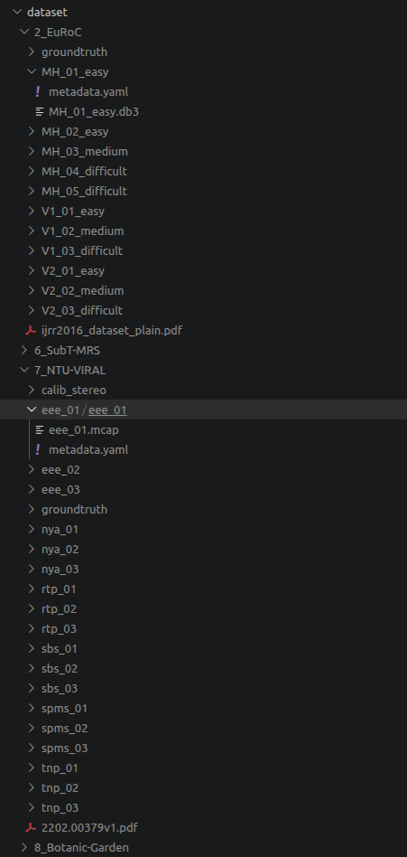

# Datasets

All bags go here. The eval runner reads `dataset/` relative to the repo root

## Download links

| Folder | Dataset | URL |
|--------|---------|-----|
| `2_EuRoC/` | EuRoC MAV | https://projects.asl.ethz.ch/datasets/euroc-mav/ |
| `6_SubT-MRS/` | SubT-MRS (ICCV 2023 VI challenge) | https://superodometry.com/iccv23_challenge_VI |
| `7_NTU-VIRAL/` | NTU-VIRAL | https://ntu-aris.github.io/ntu_viral_dataset/ |
| `8_Botanic-Garden/` | Botanic Garden | https://github.com/robot-pesg/BotanicGarden |

## Expected layout

```
dataset/
├── 2_EuRoC/
│   ├── groundtruth/                    ← <seq>_gt.tum  (pre-extracted)
│   ├── MH_01_easy/
│   │   ├── MH_01_easy.db3              ← ROS2 bag
│   │   └── metadata.yaml
│   └── ...  (MH_02–05, V1_01–03, V2_01–03)
│
├── 6_SubT-MRS/
│   ├── groundtruth/                    ← <seq>_gt.tum
│   │
│   │   # ROS2 bags — used by the DL-VINS / OKVIS2 / VINS-Fusion eval runner
│   ├── flash_light/
│   │   ├── flash_light.mcap
│   │   └── metadata.yaml
│   ├── low_light1/
│   │   ├── low_light1.mcap
│   │   └── metadata.yaml
│   ├── low_light2/
│   │   ├── low_light2.mcap
│   │   └── metadata.yaml
│   ├── over_exposure/
│   │   ├── over_exposure.mcap
│   │   └── metadata.yaml
│   ├── smoke_handheld/
│   │   ├── smoke_handheld.mcap
│   │   └── metadata.yaml
│   │
│   │   # ROS1 bags — used by scripts/letnet_baseline.sh only
│   ├── SubT_MRS_Laurel_Caverns_Handheld1/Handheld1_Rosbag/
│   │   └── raw_data_core_*_*.bag       ← low_light1 source bags
│   ├── SubT_MRS_Laurel_Caverns_Handheld2/Handheld2_Rosbag/
│   │   └── raw_data_core_*_*.bag       ← low_light2 source bags
│   ├── SubT_MRS_Laurel_Caverns_RC7_FlashLight/RC7_FlashLight_Rosbag/
│   │   └── raw_data_core_*_*.bag       ← flash_light source bags
│   ├── SubT_MRS_Laurel_Caverns_RC7_OverExposure/RC7_OverExposure_Rosbag/
│   │   └── raw_data_core_*_*.bag       ← over_exposure source bags
│   └── SubT_MRS_Laurel_Caverns_Handheld_Smoke/HandheldSmoke_Rosbag/
│       └── raw_data_core_*_*.bag       ← smoke_handheld source bags
│
├── 7_NTU-VIRAL/
│   ├── groundtruth/
│   └── <seq>/
│       └── <seq>/                      ← nested layout from the dataset zip
│           ├── <seq>.mcap
│           └── metadata.yaml
│
└── 8_Botanic-Garden/
    ├── groundtruth/
    └── <seq>_VLIO/                     ← e.g. 1005_00_VLIO/
        ├── <seq>_VLIO.mcap
        └── metadata.yaml
```



## Ground truth

GT files (`<seq>_gt.tum`) must be pre-extracted into each `groundtruth/` folder before running the eval.
Format: `timestamp_s tx ty tz qx qy qz qw` (TUM RGB-D convention).

## Notes

- SubT-MRS has two bag formats in use: ROS2 `.mcap` (for the main eval runner) and the original
  ROS1 `.bag` files (for `letnet_baseline.sh` which runs inside the `letvins:noetic` container).
  Both live under `6_SubT-MRS/` but in separate sub-directories.
- `botanic_garden` and `botanic_garden_rgb` share the same `8_Botanic-Garden/` folder —
  the gray and RGB streams are in the same bags.
